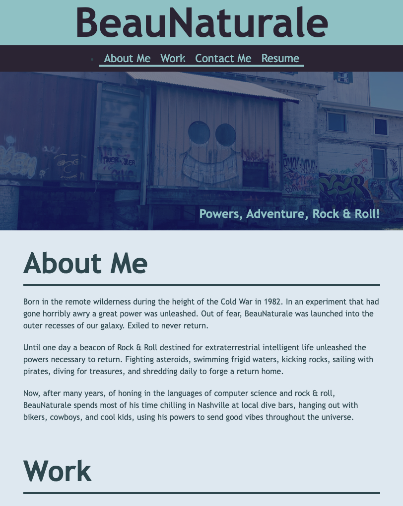

# beaunaturale-portfolio
challenge #2 portfolio webpage

Used class lessons to create an HTML, and CSS code from scratch. To build the beginnings of a portfolio web page.

Used :root pseudo-class to create a color palette. Used media queries to make the site responsive. Used flex classes to create background images.

Added links in the navigation to short cut within the page. Added links in the work section to hopefully link to future projects. Added links within the contact section for personal contact information purposes. Along with an image.

Used github, to update progress, and share for support, and launch the page.